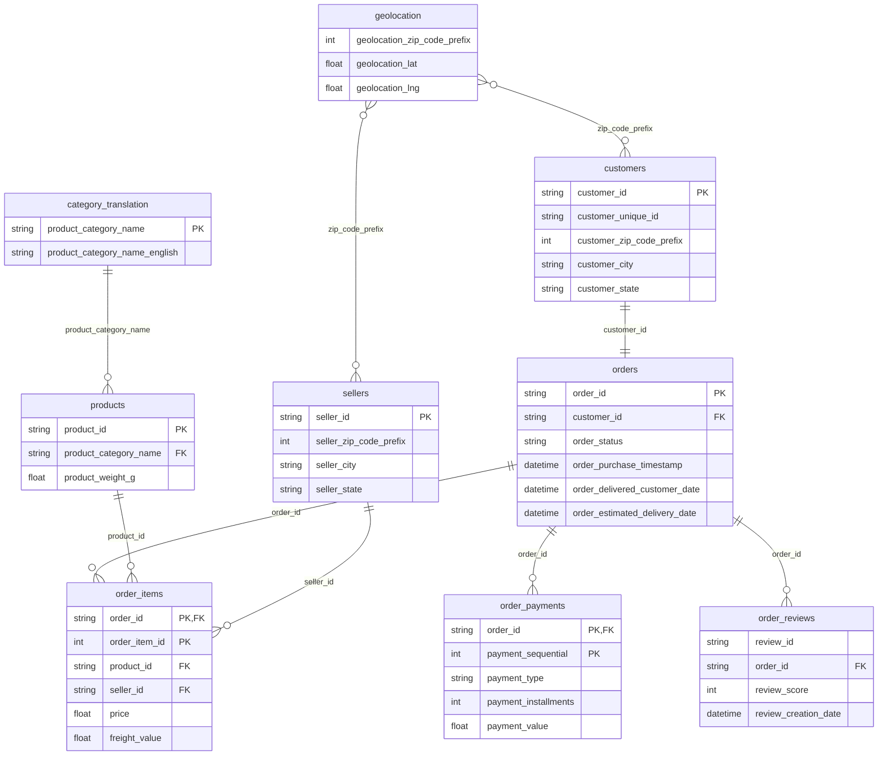

# Прогноз негативных отзывов на маркетплейсе Olist

Capstone-проект: можно ли предсказать, что клиент поставит низкую оценку (1–2★), ещё **до** того, как он её оставил, используя только данные, известные в момент доставки заказа.

## Бизнес-контекст

[Olist](https://olist.com/) — бразильский маркетплейс, объединяющий тысячи небольших продавцов. За 2016–2018 годы через платформу прошло около 100 000 заказов. После доставки клиент оценивает заказ от 1 до 5 звёзд. Низкая оценка означает репутационный риск для продавца, потерянного повторного клиента и сигнал о проблеме в логистике или качестве товара, который бизнес получает только постфактум.

Модель, заранее выделяющая группу риска, позволяет вмешаться проактивно: извиниться, предложить компенсацию или промокод до того, как клиент публично поставит низкую оценку.

## Датасет

[Brazilian E-Commerce Public Dataset by Olist](https://www.kaggle.com/datasets/olistbr/brazilian-ecommerce) — реальные анонимизированные данные, 9 связанных CSV-таблиц:

| Таблица | Содержание |
|---|---|
| `olist_orders_dataset` | заказы: даты покупки, отправки, доставки, статус |
| `olist_order_items_dataset` | позиции заказа: цена, стоимость доставки, продавец |
| `olist_order_payments_dataset` | способ и сумма оплаты |
| `olist_order_reviews_dataset` | оценка 1–5 (целевая переменная) |
| `olist_customers_dataset` | клиенты, город/штат |
| `olist_products_dataset` | категория, вес, габариты товара |
| `olist_sellers_dataset` | продавцы, город/штат |
| `olist_geolocation_dataset` | координаты почтовых индексов |
| `product_category_name_translation` | перевод категорий на английский |

> Датасет не хранится в репозитории (см. `.gitignore`). Инструкция по загрузке — ниже.

## Схема базы данных

Все таблицы загружены в SQLite (`olist.db`). Центральная таблица — `orders`: к ней по `order_id` присоединяются товары, оплаты и отзывы, а через `order_items` — продавцы и товары.



Особенности связей:
- `customer_id` уникален для каждого заказа (связь 1:1); реального покупателя идентифицирует `customer_unique_id`.
- Один заказ может содержать несколько товаров от разных продавцов и оплачиваться несколькими способами, поэтому признаки агрегируются до уровня заказа.
- У 551 заказа несколько отзывов; при очистке оставлен самый свежий.
- `geolocation` связана с клиентами и продавцами только через почтовый индекс (много строк на индекс) и в модели не используется.

**Производные таблицы**, созданные SQL-запросами в `olist.db`:

| Таблица | Как получена |
|---|---|
| `order_reviews_clean` | `ROW_NUMBER()` по `order_id` — один (последний) отзыв на заказ |
| `order_items_agg` | `GROUP BY order_id`: число товаров и продавцов, сумма, средняя цена, стоимость доставки |
| `order_payments_agg` | `GROUP BY order_id`: число способов оплаты, сумма оплаты |
| `seller_reputation`, `order_seller_rep` | средняя оценка продавца, усреднённая по продавцам заказа |
| `features` | `JOIN` всех агрегатов с `orders`, только доставленные заказы: 1 заказ = 1 строка |

## Структура репозитория

```
olist/
├── DataGroup_Capstone_Dana_Toktargaliyeva.ipynb   # весь код: SQL → EDA → таргет → модели → выводы
├── DataGroup_Capstone_Dana_Toktargaliyeva.pdf     # презентация для защиты
├── requirements.txt                               # зависимости
├── .gitignore                                     # исключает CSV, olist.db и служебные файлы
└── README.md
```

## Как запустить

1. Клонировать репозиторий:
   ```bash
   git clone https://github.com/danatoktargaliyeva/olist.git
   cd olist
   ```
2. Установить зависимости (Python 3.10+):
   ```bash
   pip install -r requirements.txt
   ```
3. Скачать датасет с [Kaggle](https://www.kaggle.com/datasets/olistbr/brazilian-ecommerce) и распаковать все 9 CSV-файлов **в корень репозитория** (рядом с ноутбуком).
4. Открыть ноутбук и выполнить все ячейки по порядку:
   ```bash
   jupyter notebook DataGroup_Capstone_Dana_Toktargaliyeva.ipynb
   ```
   База `olist.db` создаётся автоматически при запуске.

## Методология

### 1. База данных и SQL
- Все 9 таблиц загружены в SQLite; схема связей — в разделе выше.
- Дубли отзывов убраны оконной функцией `ROW_NUMBER()`.
- Признаки собраны SQL-запросами с `JOIN` и `GROUP BY`; сроки доставки посчитаны через `julianday()`.
- Итоговая витрина `features`: **95 823 доставленных заказа × 10 признаков**.
- 8 заказов со статусом `delivered`, но без даты доставки, удалены (0.01%).

### 2. EDA
- Проверены размеры, пропуски и дубли по всем таблицам; пропуски в датах заказов соответствуют недоставленным заказам.
- Распределение оценок сильно смещено: 59% — «5», 13% — «1–2».
- Медианный срок доставки при оценке 1 — около 17 дней, при оценке 5 — около 9.
- Даже заказы с оценкой 1 в медиане приходят раньше обещанной даты, но с заметно меньшим запасом (≈6 дней против ≈12 при оценке 5).
- Сумма заказа, рейтинг продавца и количество товаров связаны с оценкой заметно слабее, чем сроки доставки.

### 3. Целевая переменная
`is_bad_review = 1`, если `review_score ≤ 2`, иначе `0`. Доля негативного класса — **12.8%**.

Почему такой порог: 1–2★ — однозначное недовольство, на которое имеет смысл реагировать компенсацией. Оценка 3 нейтральна; её включение раздуло бы группу риска и стоимость интервенций.

### 4. Машинное обучение
- Стратифицированное разбиение 80/20, `class_weight='balanced'` для компенсации дисбаланса.
- Метрики: ROC-AUC, precision, recall, F1 для класса «плохой отзыв». Accuracy не используется: модель, всегда предсказывающая «хороший отзыв», получила бы 87%.

## Результаты

| Модель | ROC-AUC | Precision | Recall | F1 |
|---|---|---|---|---|
| Logistic Regression | 0.766 | 0.290 | 0.612 | 0.393 |
| **Random Forest** | **0.790** | **0.380** | 0.561 | **0.453** |

**Финальная модель — Random Forest**: лучший баланс точности и полноты. Среди заказов, которые она помечает как рискованные, 38% действительно получают 1–2★ — втрое больше базовой доли 12.8%. Logistic Regression находит чуть больше плохих отзывов, но с большим числом ложных тревог.

**Важность признаков (Random Forest):**

| Признак | Важность |
|---|---|
| запас до обещанной даты доставки | 31.8% |
| срок доставки | 25.6% |
| средний рейтинг продавца | 19.4% |
| количество товаров в заказе | 8.5% |
| остальные (стоимость доставки, суммы, цены, число продавцов, способы оплаты) | < 5% каждый |

## Бизнес-выводы и рекомендации

- **Клиенты оценивают прежде всего логистику**: признаки сроков доставки дают около 57% суммарной важности. Сумма заказа и способ оплаты почти не влияют.
- **Скоринг при доставке**: оценивать каждый заказ моделью и проактивно работать с группой риска (извинение, промокод, звонок поддержки). Модель помечает около 19% заказов и находит 56% будущих негативных отзывов.
- **Мониторинг доставки**: отдельно отслеживать заказы, где срок доставки превышает медиану или запас до обещанной даты сокращается.
- **Работа с продавцами** с низким рейтингом: SLA на отгрузку, приоритет в поддержке.

## Ограничения

- **Утечка данных**: `avg_seller_score` рассчитан по всем заказам продавца, включая текущий. Из-за этого качество модели может быть несколько завышено. Корректно считать рейтинг только по более ранним заказам.
- Для заказов с несколькими продавцами рейтинг усредняется, что сглаживает эффект отдельного продавца.
- ROC-AUC 0.79 показывает, что часть причин недовольства (качество товара, общение с продавцом) в структурированных данных не отражена.
- Текст отзывов не использовался (NLP вне рамок проекта).

## Дальнейшее развитие

- Рейтинг продавца только по историческим заказам.
- Сезонность (месяц, день недели заказа), расстояние продавец–клиент по штатам.
- Подбор порога вероятности под бюджет компенсаций.
- Масштабирование признаков для корректной интерпретации коэффициентов логистической регрессии.

## Стек

Python · pandas · NumPy · SQLite (`sqlite3`) · Matplotlib · Seaborn · scikit-learn · Jupyter

## Автор

**Dana Toktargaliyeva** — [GitHub](https://github.com/danatoktargaliyeva)
